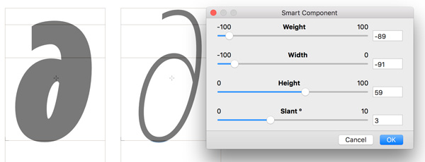

## MathFont — a generic Math Symbols Font

MathFont is a generic font with Math symbols, that you can 
customise, and use for populating your own Opensource fonts.

## Customisation

The source files are available only in Glyphs App Format. 
Customisation is implemented using the smart components feature.
To tailor a glyph to your needs, select a component,  press **[Cmd+shift+I]**, 
and adjust the sliders. 

There are three main axes to alter:
* Weight, from 'Light' to 'Bold'
* Width, from 'Normal' to 'Condensed'
* Height[in development]

For symbols that have a slanted/italic variant [∂ μ π ∆ Ω], 
a fourth Slant Degree axis is provided. 

### License
Mathfont is released under the SIL OFL License.
MathFont is derived from Noto Sans.
Noto Sans is designed by Monotype design team.

